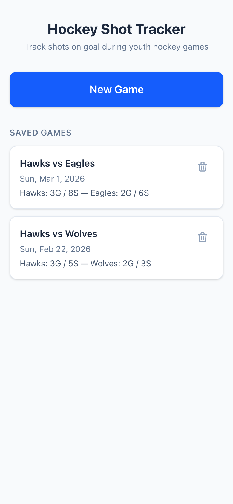
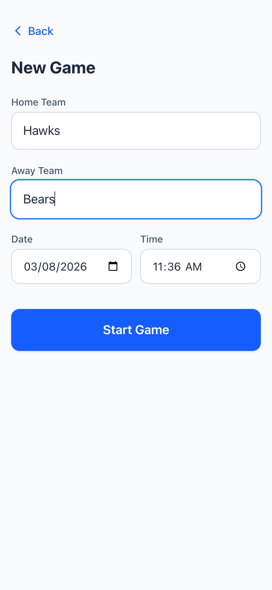
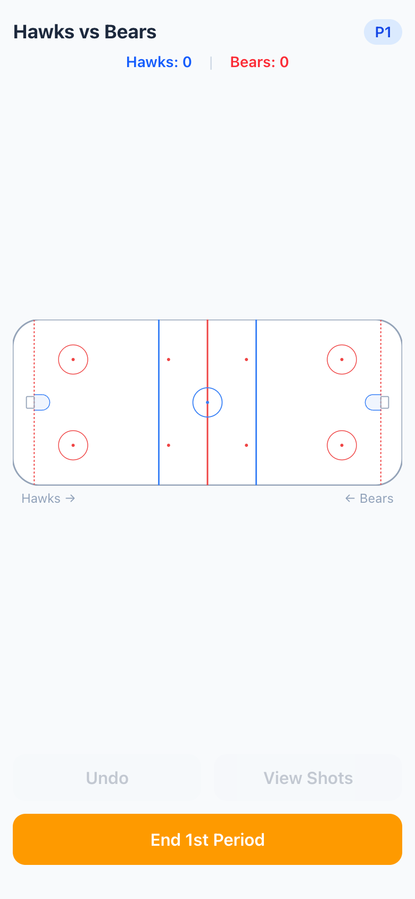
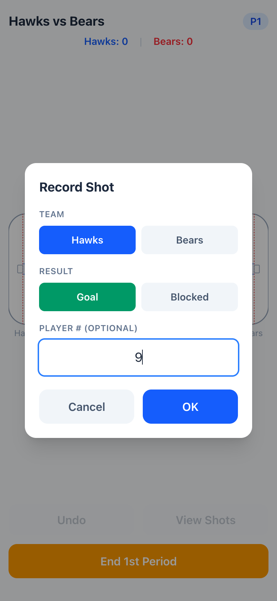
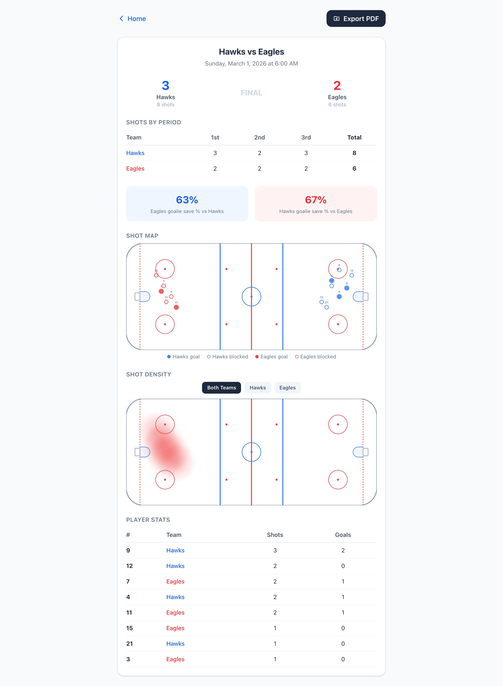

# Hockey Shot Tracker

A free, simple app for tracking shots on goal during hockey games. Built for coaches and parents who want to turn game data into teachable moments.

**Use it now:** [dvelton.github.io/hockey-shot-tracker](https://dvelton.github.io/hockey-shot-tracker/)

No downloads, no accounts, no fees. Open the link on your phone, tablet, or computer and start tracking.

---

## What It Does

Hockey Shot Tracker lets you record every shot on goal as it happens during a game, capturing where on the ice each shot came from. After the game, you get a full summary report with shot maps, heatmaps, save percentages, and player breakdowns you can use to review the game with your team.

## How It Works

### 1. Start a new game

Tap "New Game," enter the two team names, and you're ready to go. The date and time fill in automatically.

<p align="center">
  
  &nbsp;&nbsp;&nbsp;
  
</p>

### 2. Track shots during the game

The app displays a clean whiteboard-style hockey rink. When a shot on goal happens, tap the spot on the ice where it came from. A quick popup lets you tag the shot with which team took it, whether it was a goal or a save, and optionally the player's jersey number. Tap OK and you're back to watching the game.

The rink stays clean throughout. No clutter, no marks piling up. You can tap "View Shots" any time to pull up an overlay of everything you've recorded so far, then dismiss it and keep going.

<p align="center">
  
  &nbsp;&nbsp;&nbsp;
  
</p>

Other things you can do during the game:

- **Undo** the last shot if you mis-tap
- **Running shot counter** at the top so you always know the totals
- **Period management** handles the full flow: 1st, 2nd, and 3rd periods, plus optional overtime for tournament games
- The rink **flips orientation** between periods since teams switch ends (just like a real game)

### 3. Review the game summary

After the final period, tap "End & Save Game" and the app generates a full summary report:

- Final score and total shots per team
- Period-by-period shot breakdown
- Goalie save percentages
- Shot location map showing every shot plotted on the rink (goals are filled circles, saves are open circles)
- Shot density heatmap you can filter by team
- Per-player stats (shots and goals) for any players you tagged by number

<p align="center">
  
</p>

### 4. Export and revisit

- **Export as PDF** to share with your coaching staff or email to parents
- All games are **saved automatically** and show up on the home screen so you can revisit any past game's summary

## Tips for Coaches

- You don't have to fill in every field on the shot popup. If the action is fast and you just want to capture the location, tap the ice and hit OK. You can always tell the story from the shot map later.
- If you have an assistant coach or parent willing to help, one person can track home shots and the other can track away shots.
- The heatmap is particularly useful for showing players where the team is generating offense from and where the opposing team is getting their looks. 
- The per-player stats are only as good as the jersey numbers you enter, so don't stress about catching every one. Even partial data tells a story.

## Privacy and Data

Your data stays on your device. The app saves games to your browser's local storage, which means no data is uploaded anywhere, no account is needed, and nobody else can see your games. The tradeoff is that if you clear your browser data or switch to a different device, your saved games won't carry over.

---

## Technical Details

Built with React, Vite, and Tailwind CSS. The hockey rink is an inline SVG, the heatmaps use HTML Canvas, and PDF export uses html2canvas + jsPDF. Deployed as a static site to GitHub Pages via GitHub Actions. No backend, no database, no server costs.

To run locally for development:

```
git clone https://github.com/dvelton/hockey-shot-tracker.git
cd hockey-shot-tracker
npm install
npm run dev
```

---

## Dedication

Dedicated to my son's 12U hockey team. Good luck in the playoffs. Go Hawks!
